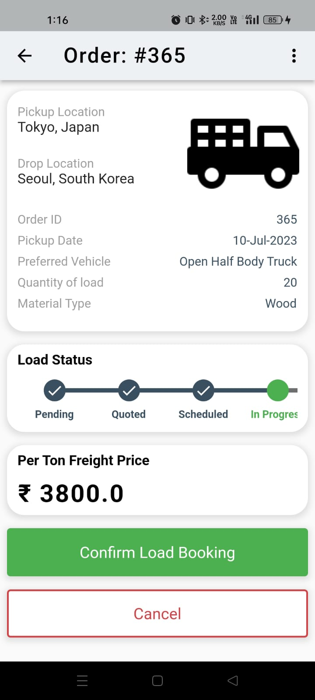
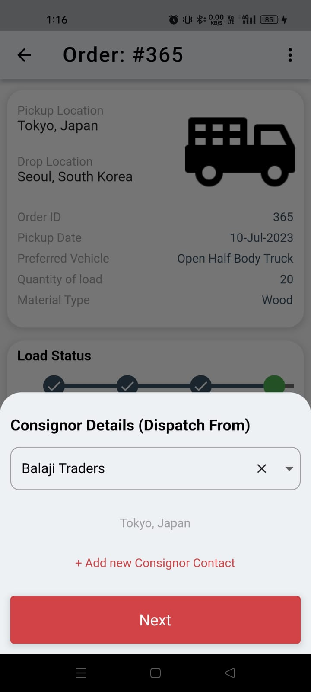

# Shyp Clone

Flutter UI To replicate Shyp App

# To Run The App

```
1. Clone Repo
2. cd shypclone
3. flutter pub get
4. flutter run
```

## Sample UI Images

1. Home Page

   

2. Ongoing Load Page

   

3. Order Details Page

   

4. Next Stage

   

5. Confirmation Stage

   
